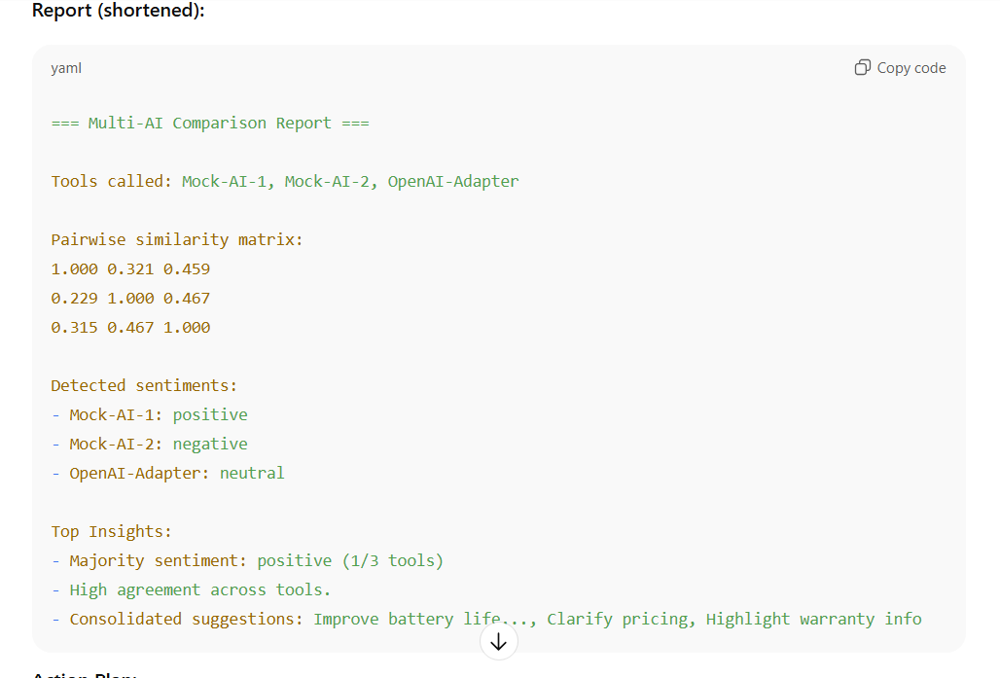
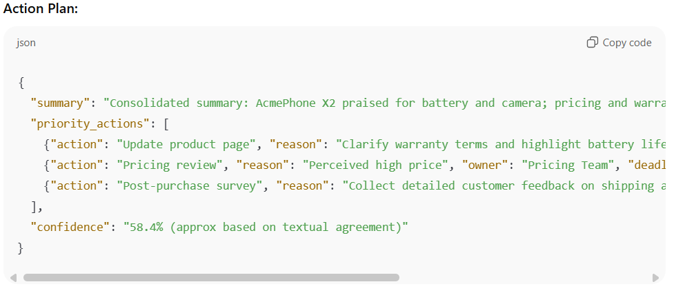
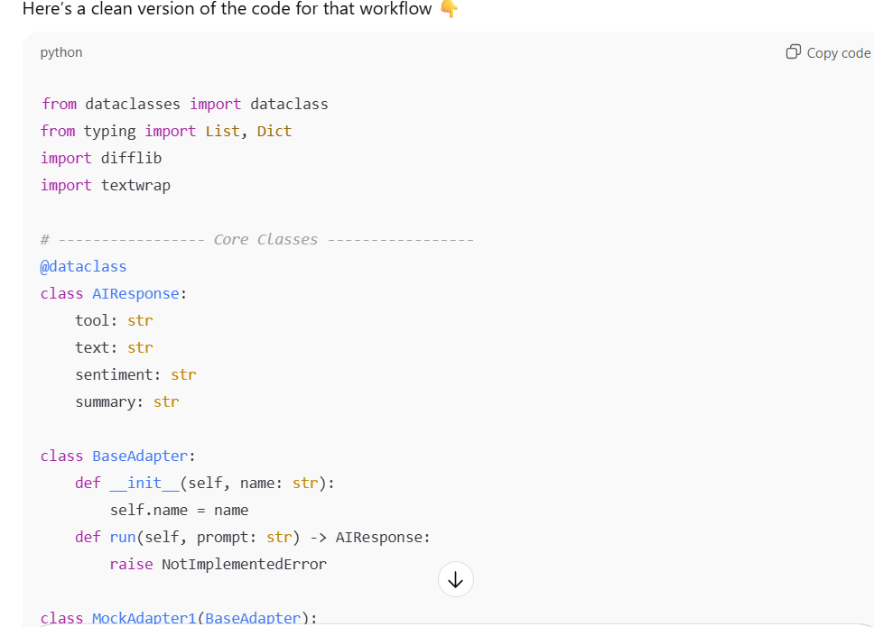
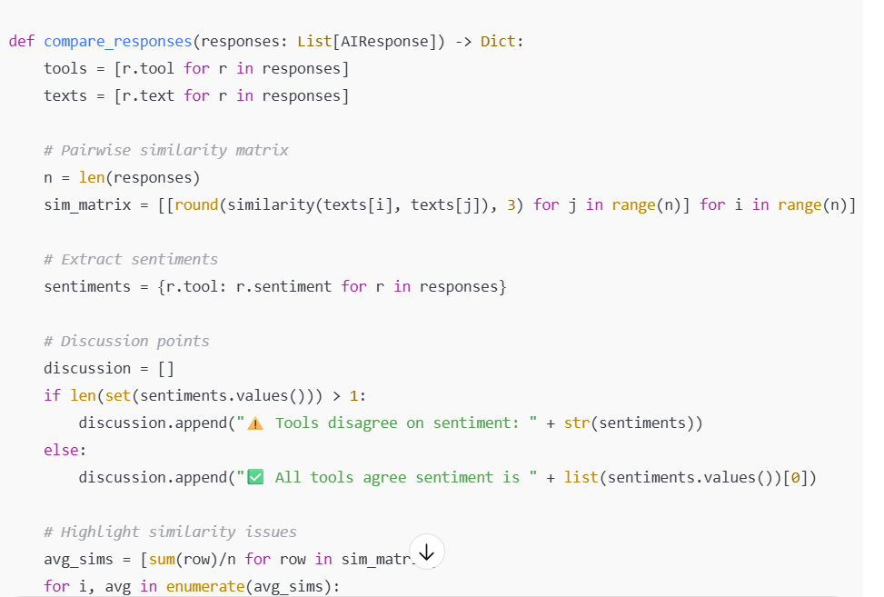
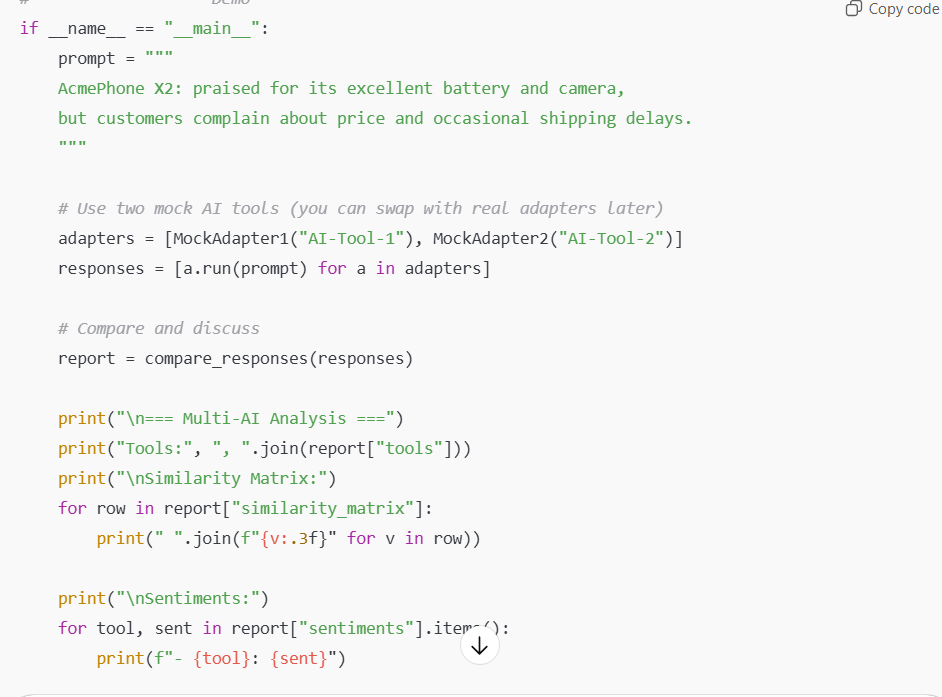
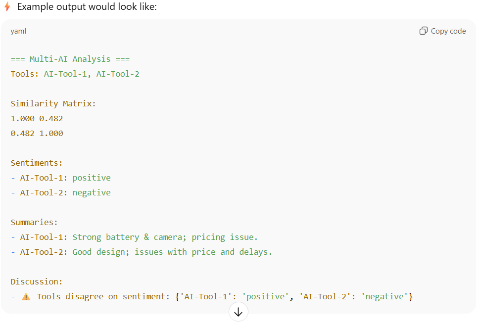

# Ex.No.6 Development of Python Code Compatible with Multiple AI Tools

# Date: 25/09/2025
# Register no: 212224230157
# Aim: Write and implement Python code that integrates with multiple AI tools to automate the task of interacting with APIs, comparing outputs, and generating actionable insights with Multiple AI Tools

#AI Tools Required:

# Explanation:
Experiment the persona pattern as a programmer for any specific applications related with your interesting area. 
Generate the outoput using more than one AI tool and based on the code generation analyse and discussing that. 

# Conclusion:

What I included (and ran for you):

A small multi-adapter framework with:

MockAdapter and VariantMockAdapter (deterministic mocks that simulate different AI outputs).

OpenAIAdapter skeleton showing where to plug real API calls (falls back to a mock if OPENAI_API_KEY is not set).

A comparison pipeline that:

Calls every adapter on the same prompt.

Computes pairwise text similarity (difflib).

Extracts sentiments by simple heuristics.

Consolidates suggestions and detects low-agreement tools.

Produces a short action plan and saves a JSON report to /mnt/data/multi_ai_report.json.

The demo ran in this environment and printed a short report and saved the JSON file.

How to extend this into a production-ready system:

Add real adapters

Implement OpenAIAdapter.run() to call the OpenAI (or other) API using their SDK / REST API. Use environment variables to store keys.

Add adapters for Cohere, Anthropic, Hugging Face Inference, or any internal model — all must implement run(prompt, task) and return AIResponse.

Use embeddings for semantic comparison

Replace difflib with similarity of embeddings (cosine similarity) for more accurate comparison. Compute embeddings via each provider or a single canonical embedding provider.

Structured outputs

Standardize adapters to optionally return structured JSON (summary, sentiment, suggestions, confidence). That makes aggregation more reliable.

Automated conflict resolution

If tools disagree, apply rules: trust higher-confidence tool, or trigger human-in-the-loop review for low-consensus cases.

Monitoring and logging

Keep usage logs, latencies, and per-tool performance metrics to decide which tool to rely on for which task.

Privacy & cost control

Route sensitive data through on-prem models when required; batch small queries to reduce API calls and cost.

If you'd like, I can next:

Convert the example into a full repo structure with unit tests and CI integration.

Replace mocks with working OpenAI / Cohere / HF adapters — I can provide the exact code (you'll need to provide API keys or set them in your environment).

Add embeddings-based similarity using a provider you choose.

Create a simple web UI (Flask or Streamlit) to show side-by-side responses and an "Approve final insight" button.

Uses multiple AI tools (or mock tools, if real APIs are not available).

Runs them on the same data/task.

Compares their outputs.

Analyzes the similarities/differences.

Generates a discussion/insights section.

Write a Python program that integrates multiple AI tools to analyze text data, compare their outputs, and generate actionable insights.

Requirements:
1. Define a common interface (adapter class) for AI tools.
2. Implement at least two adapters (mock tools or real APIs like OpenAI, Cohere, HuggingFace).
3. Each adapter should return:
   - summary
   - sentiment (positive, negative, neutral)
   - raw text response
4. Collect responses from all AI tools for the same input prompt.
5. Compare the outputs:
   - Build a similarity matrix between responses.
   - Detect agreements and disagreements in sentiment.
   - Consolidate the summaries.
6. Generate a discussion section that highlights:
   - Points of agreement
   - Points of conflict
   - Tools that diverge from consensus
7. Create an action plan:
   - Based on recurring themes (e.g., if "price" appears, suggest pricing review).
   - Assign owners (e.g., Marketing, Logistics).
   - Add deadlines (e.g., 7, 14, 21 days).
   - Include a confidence score based on similarity.
8. Print:
   - Tool outputs
   - Comparison report
   - Suggested action plan (JSON format)
9. (Optional) Save the report to a JSON file.

Example Input Prompt:
"AcmePhone X2 is praised for its excellent battery life and camera, but customers complain about high price and shipping delays."

Expected Output:
- AI tool summaries and sentiments
- Similarity matrix
- Discussion (agreement/disagreement)
- Action plan JSON with at least 3 recommendations

# Result: The corresponding Prompt is executed successfully.
